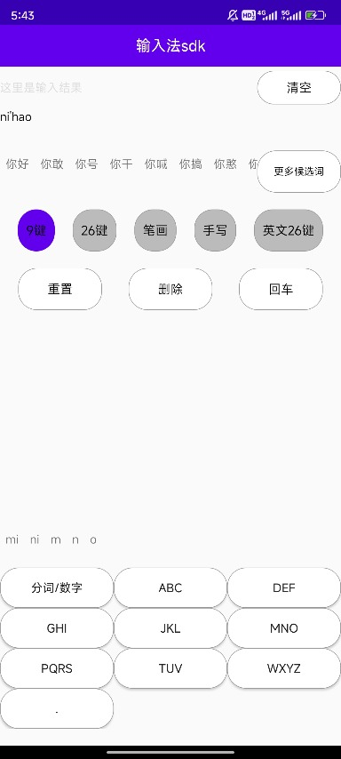
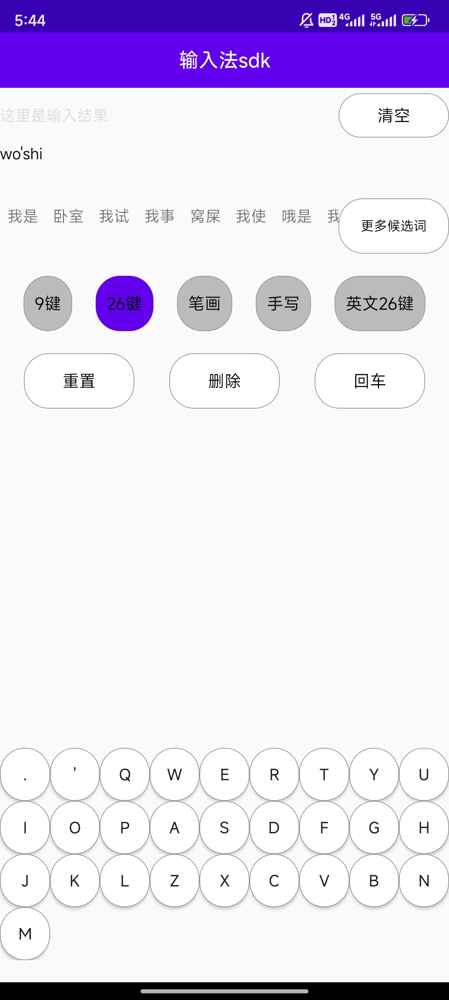
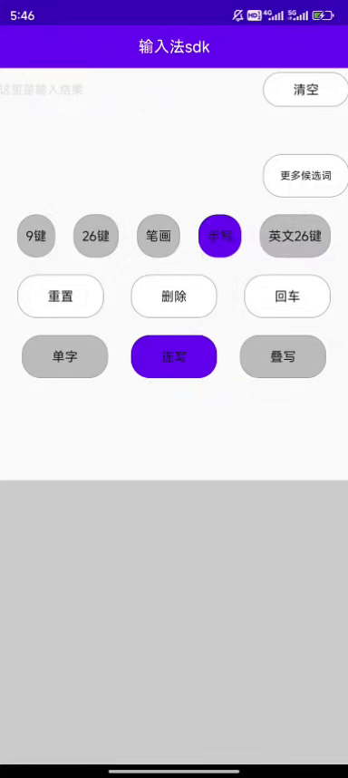
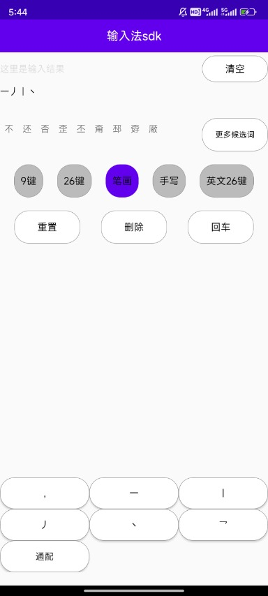

## >>>持续更新维护中>>> [2024年9月16日]
---
## 更新日志

---
2024年09月14日 更新：
1. 2024年最新最智能的输入法sdk，最新词库，支持9键拼音、26键拼音、笔画等输入模式
2. 基于pytorch深度学习模型开发的手写sdk，支持叠写、连写、单字模式，识别率99%

---

### Demo 下载 >>> https://github.com/cyfsdk/android_keyboard_sdk/blob/main/ai_keyboard.apk

## 简介

## **演示**

| 9键拼音          | 26键拼音          | 手写            | 笔画            |
|---------------|----------------|---------------|---------------|
|  |  |  |  |

## 功能

可以提供以下功能：
1，支持9键拼音、26键拼音、笔画等输入模式,最新词库，支持联想词、缓存词、分词、智能纠错等功能，让用户越用越舒服
2，支持手写识别（叠写、连写、单字），最智能的手写功能，采用pytorch深度学习模型开发，识别率和识别速度全面超越某文、某云等

## 使用要求

1. 目前只支持android端接入，已在项目实战中大规模使用，可直接商用

## 联系方式

请注明来意，根据以下联系方式获取：
1，QQ：847659598
2，微信号：ai_sdk888